## Benchmarking

To run the benchmark yourself, run the following commands:

```sh
git clone https://github.com/Fabricio-191/SQLazo
cd SQLazo
npm i
npm run bench
```

Everything is measured in operations per second (ops/s).

### Conditions

100 rows    | SELECT             | SELECT IN TRANSACTION |
------------|--------------------|-----------------------|
JS          | 2648               | 3983                  |
SQL         | 4911               | 9550                  |
ALL         | 2663               | 2990                  |

100000 rows | SELECT             | SELECT IN TRANSACTION |
------------|--------------------|-----------------------|
JS          | 11.23              | 12.29                 | 
SQL         | 29.63              | 30.24                 |
ALL         | 6.28               | 6.57                  |

### Insert

INSERT      | many (transaction) | each                  |
------------|--------------------|-----------------------|
10 rows     | 6.96               | 0.77                  |
100 rows    | 7.45               | 0.07                  |

```mermaid
gantt
	title 100 rows
    dateFormat x
    axisFormat %s

    section SELECT
    JS    :0, 2648s
    SQL   :0, 4911s
    ALL   :0, 2663s

    section SELECT IN TRANSACTION
    JS    :0, 3983s
    SQL   :0, 9550s
    ALL   :0, 2990s
```

<!--


```mermaid
%%{init: {
	'logLevel': 'debug',
	'gantt': { 'barHeight':25 } 
} }%%
gantt
	title 100000 rows
    dateFormat X
    axisFormat %s

    section SELECT
    JS    :0.0, 11.23
    SQL   :0.0, 29.63
    ALL   :0.0, 6.28

    section SELECT IN TRANSACTION
    JS    :0.0, 12.29
    SQL   :0.0, 30.24
    ALL   :0.0, 6.57
```
-->

==- Raw results
```
with 100 rows:

SELECT
JS  x 2648 ops/sec ±18.51% (80 runs sampled)
SQL x 4911 ops/sec ±7.76% (74 runs sampled)
ALL x 2663 ops/sec ±1.10% (86 runs sampled)

SELECT IN TRANSACTION
JS  x 3983 ops/sec ±7.27% (88 runs sampled)
SQL x 9550 ops/sec ±1.96% (87 runs sampled)
ALL x 2990 ops/sec ±4.24% (85 runs sampled)


with 100000 rows:

SELECT
JS  x 11.23 ops/sec ±3.75% (32 runs sampled)
SQL x 29.63 ops/sec ±0.69% (52 runs sampled)
ALL x  6.28 ops/sec ±6.57% (20 runs sampled)

SELECT IN TRANSACTION
JS  x 12.29 ops/sec ±0.90% (35 runs sampled)
SQL x 30.24 ops/sec ±0.64% (53 runs sampled)
ALL x  6.57 ops/sec ±1.63% (21 runs sampled)


inserting 10 rows:
many (transaction) x 6.96 ops/sec ±24.65% (23 runs sampled)
each               x 0.77 ops/sec ±9.62% (6 runs sampled)

inserting 100 rows
many (transaction) x 7.45 ops/sec ±7.59% (21 runs sampled)
each               x 0.07 ops/sec ±2.88% (5 runs sampled)
```
===