To run the benchmark yourself, run the following commands:

```sh
git clone https://github.com/Fabricio-191/simplest.db
cd simplest.db
npm i
npm run bench
```

Everything is measured in operations per second (ops/s).  

## SQLite

```mermaid
gantt
	title with cache
    dateFormat x
    axisFormat %s

    section SQLite
    get    : 0, 5125s
    set    : 0, 237s
    delete : 0, 713s
```



```mermaid
gantt
	title without cache
    dateFormat X
    axisFormat %s

    section SQLite
    set    : 0.0, 14.59
    delete : 0.0, 16.27

    section quick.db
    set    : 0.0, 2.49
    get    : 0.0, 6.58
    delete : 0.0, 9.12
```

## JSON

```mermaid
gantt
	title with cache
    dateFormat x
    axisFormat %s

    section JSON
    get    :0, 3618s
    set    :0, 5097s
    delete :0, 4522s

    section megadb
    get    :0, 1985s
    delete :0, 2210s
```



```mermaid
gantt
	title without cache
    dateFormat X
    axisFormat 0.%L          

    section JSON
    set    :0, 0.16
    delete :0, 0.53

    section megadb
    set    :0.0, 0.11
```

==- Raw results
```
JSON
set    x 3618 ops/sec ±8.01% (77 runs sampled)
get    x 5097 ops/sec ±0.64% (92 runs sampled)
delete x 4522 ops/sec ±0.92% (90 runs sampled)

JSON (writing every time)
set    x 0.16 ops/sec ±14.63% (5 runs sampled)
delete x 0.53 ops/sec ±30.07% (6 runs sampled)

megadb
set (writes every time) x 0.11 ops/sec ±25.79% (5 runs sampled)
get (uses cache)        x 1985 ops/sec ±0.42% (94 runs sampled)
delete (uses cache)     x 2210 ops/sec ±0.40% (94 runs sampled)

SQLite
set    x  237 ops/sec ±0.61% (85 runs sampled)
get    x 5125 ops/sec ±0.46% (92 runs sampled)
delete x  713 ops/sec ±1.75% (90 runs sampled)

SQLite (writing every time)
set    x 14.59 ops/sec ±0.94% (40 runs sampled)
delete x 16.27 ops/sec ±0.47% (44 runs sampled)

quick.db (writes/reads every time)
set    x 2.49 ops/sec ±2.86% (11 runs sampled)
get    x 6.58 ops/sec ±1.55% (21 runs sampled)
delete x 9.12 ops/sec ±1.10% (27 runs sampled)
```
===
