To run the benchmark yourself, run the following commands:

```sh
git clone https://github.com/Fabricio-191/simplest.db
cd simplest.db
npm i
npm run bench
```

Everything is measured in operations per second (ops/s).  

## SQLite

```mermaid
gantt
	title with cache
    dateFormat X
    axisFormat %s

    section SQLite
    set    : 0, 611s
    get    : 0, 2582s
    has    : 0, 2658s
    delete : 0, 798s
```



```mermaid
gantt
	title without cache
    dateFormat X
    axisFormat %s

    section SQLite
    set    : 0.0, 278.0
    delete : 0.0, 324.0

    section quick.db
    set    : 0.0, 25.77
    get    : 0.0, 71.47
    has    : 0.0, 71.79
    delete : 0.0, 67.36
```

## JSON

```mermaid
gantt
	title with cache
    dateFormat X
    axisFormat %s

    section JSON
    set    :0, 2498s
    get    :0, 2544s
    has    :0, 2555s
    delete :0, 2142s

    section megadb
    get    :0, 914s
    has    :0, 974s
    delete :0, 1019s
```



```mermaid
gantt
	title without cache
    dateFormat X
    axisFormat 0.%L          

    section megadb
    set    :0.0, 1.86
```

==- Raw results
```
megadb
set (writes every time) x 1.86 ops/sec ±14.58% (9 runs sampled)
get                     x  914 ops/sec ±2.26% (93 runs sampled)
has                     x  974 ops/sec ±2.67% (90 runs sampled)
delete                  x 1019 ops/sec ±1.91% (94 runs sampled)

JSON
set    x 2498 ops/sec ±0.16% (98 runs sampled)
get    x 2544 ops/sec ±0.52% (98 runs sampled)
has    x 2555 ops/sec ±0.11% (99 runs sampled)
delete x 2142 ops/sec ±2.66% (95 runs sampled)

quick.db (writes/reads every time)
set    x 25.77 ops/sec ±4.65% (47 runs sampled)
get    x 71.47 ops/sec ±2.07% (74 runs sampled)
has    x 71.79 ops/sec ±2.31% (74 runs sampled)
delete x 67.36 ops/sec ±2.04% (70 runs sampled)

SQLite (writing every time)
set    x 278 ops/sec ±1.37% (88 runs sampled)
delete x 324 ops/sec ±0.24% (91 runs sampled)

SQLite
set    x  611 ops/sec ±0.38% (96 runs sampled)
get    x 2582 ops/sec ±0.55% (97 runs sampled)
has    x 2658 ops/sec ±0.43% (94 runs sampled)
delete x  798 ops/sec ±0.56% (96 runs sampled)
```
===
